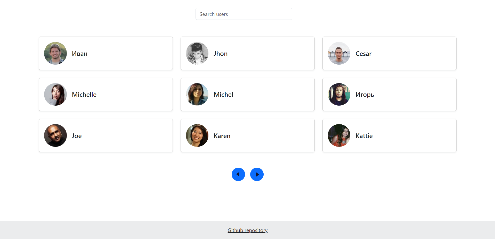
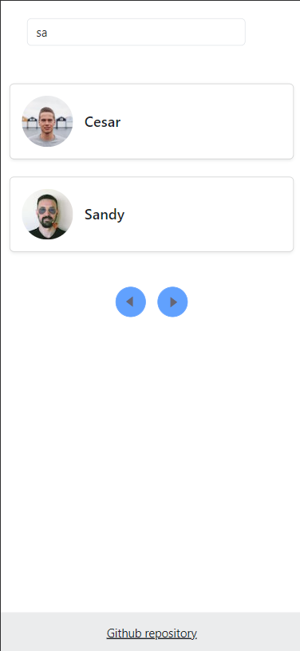

# user-searcher

Overview
--------

This is a single-page application (SPA) that allows an admin to search for users of a bot. The application displays a list of bot users, with each user represented by their avatar and name. The admin can filter the list of users by entering a search query, and the list will automatically update to show only the matching users.

The application uses Mirage.js to simulate an API for fetching user data.

Features
--------

* Displays a list of bot users, with each user represented by their avatar and name.
* Allows the admin to filter the list of users by entering a search query.
* Uses Mirage.js to simulate an API for fetching user data.

Technical Details
-----------------

* The application is built using HTML, CSS, and JavaScript.
* The user data is stored in a local array and fetched using Mirage.js to simulate an API.
* The application uses Bootstrap for styling.

Usage
-----

* Open the <a href='https://mkh1n.github.io/user-searcher'>SPA</a> in a web browser.
* Enter a search query in the search input field.
* The list of users will automatically update to show only the matching users.

API
---

The application simulates an API using Mirage.js. The API has the following endpoint:

* `GET /api/users?searchTerm={value}`: Returns a list of users that match the search query. The response includes the following fields:
	+ `result`: An array of user objects, where each object has the following fields:
		- `id`: The user's ID.
		- `name`: The user's name.
		- `avatarUrl`: The URL of the user's avatar.
	+ `nextPageUrl`: The URL of the next page of results (if available).
	+ `previousPageUrl`: The URL of the previous page of results (if available).

Limitations
-----------

* The application currently only supports searching by user name. In the future, it may be expanded to support searching by other user attributes.
* The application assumes that there may be more than one million users in a single bot.

